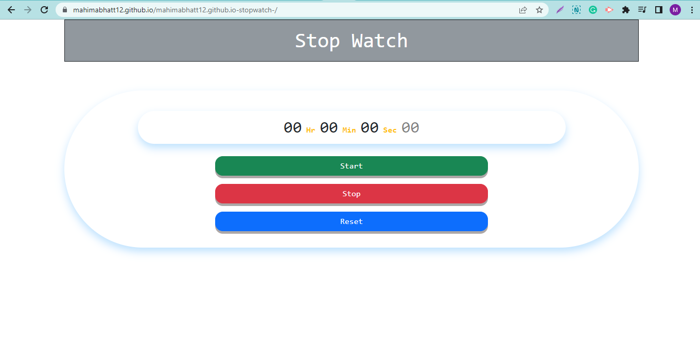

# CodingNinja-Stopwatch-Project

### View this web page at : https://mahimabhatt12.github.io/mahimabhatt12.github.io-stopwatch-/

## Problem statement

   Create a stopwatch app. Use ONLY vanilla javascript, no libraries or frameworks allowed for Javascript (you can use any css framework like Bootstrap).

## Features

* Start Timer
  1.  On click of start button, start the timer.
  2.  If timer is 0 start from beginning else start from wherever last stopped

* Stop Timer
  1. Stop timer once clicked on the stop button

* Reset Timer
  1.  On click of reset stop the watch (if already started) and set timer as 0

## Previews

  

## Approach

  1.  Create one main container in which all the elements are present.
  2.  Inside this container add a sub-div in which there are two rows, the first row contains all the time elements like an hour, minutes, seconds, and milliseconds. and another row contains 3 buttons for start, stop, and reset.
  3.  Now adding styling to my HTML page as shown in the demo video.
  4.  At last, there is a JavaScript file in which I have added addEventListener() on click functions on all three buttons and created another function which writes all the logical code and adds value to corresponding variables hours, minutes, seconds, milliseconds, etc.
